# 📚 Módulo de Calificaciones – Spring Boot

## Descripción General

Este módulo, desarrollado en **Java Spring Boot**, forma parte de un sistema backend modular para la gestión y evaluación de presentaciones orales. Permite crear, consultar, actualizar y eliminar calificaciones, criterios de evaluación, detalles de calificación, feedbacks y parámetros ideales. Es compatible con bases de datos PostgreSQL (usando Supabase).

---

## 🚀 ¿Cómo inicializar el proyecto?

### 1. Clonar el repositorio

```bash
git clone https://github.com/tuusuario/tu-repo.git
cd springboot-modulo
````

### 2. Instalar dependencias

El proyecto utiliza **Maven** como gestor de dependencias. No necesitas instalar nada extra si usas el wrapper que ya viene en el proyecto.

```bash
./mvnw clean install
```

O si tienes Maven instalado globalmente:

```bash
mvn clean install
```

### 3. Configurar la base de datos

Define las variables de entorno `DB_USERNAME` y `DB_PASSWORD` con las credenciales de tu instancia de PostgreSQL (por ejemplo, Supabase). El archivo `application.properties` lee estas variables automáticamente.

### 4. Levantar el proyecto

```bash
./mvnw spring-boot:run
```

O, si tienes Maven instalado globalmente:

```bash
mvn spring-boot:run
```

El backend estará disponible en [http://localhost:8080](http://localhost:8080).

---

## 📁 Estructura del Módulo

```
/springboot-modulo
│
├── src/
│   ├── controller/         # Controladores REST
│   ├── service/            # Lógica de negocio
│   ├── repository/         # Interfaces JPA para acceso a datos
│   ├── model/              # Entidades JPA
│   ├── dto/                # Objetos de transferencia de datos
│   ├── mapper/             # Conversores entidad-DTO
│   ├── config/             # Configuración (seguridad, etc.)
│
├── screenshots/            # Evidencias de pruebas (Postman)
│   ├── calificacion_delete.png
│   ├── calificacion_get_delete.png
│   ├── calificacion_getbyid.png
│   ├── calificacion_post.png
│   ├── calificacion_put.png
│   ├── calificaciones_get.png
│   ├── get_criterios.png
│   ├── get_detalles.png
│   ├── get_parametros_ideales.png
│   ├── getfeedback.png
│   ├── post_supabase.png
│   └── revision_post.png
│
├── README.md
└── application.properties
```

---

## 🌍 Contexto Internacional

Este módulo fue desarrollado para un emprendimiento internacional que automatiza la gestión de calificaciones en presentaciones orales en instituciones educativas fuera de Ecuador. El enfoque es la adaptabilidad y escalabilidad para contextos internacionales.

---

## 🏗️ Entidades Principales

* **Calificacion:** Evaluación global de una grabación de presentación.
* **CriterioEvaluacion:** Criterios para evaluar presentaciones (claridad, estructura, etc.).
* **DetalleCalificacion:** Detalle individual de calificación por criterio.
* **FeedbackCalificacion:** Retroalimentación sobre la calificación.
* **ParametrosIdeales:** Parámetros de referencia para la evaluación (velocidad, pausas, claridad).

---

## 🔒 Seguridad

El módulo está protegido con **Spring Security**.

* Autenticación: Basic Auth
* Usuario para pruebas:

  * **Username:** `admin`
  * **Password:** `admin123`

---

## 🌐 Endpoints REST

### Calificaciones

* **GET** `/api/calificaciones` – Listar todas
* **GET** `/api/calificaciones/{id}` – Buscar por ID
* **POST** `/api/calificaciones` – Crear
* **PUT** `/api/calificaciones/{id}` – Actualizar
* **DELETE** `/api/calificaciones/{id}` – Eliminar
* **POST** `/api/calificaciones/ai` – Aplicar calificación con IA

### Criterios de Evaluación

* **GET** `/api/criterios` – Listar todos

### Detalles de Calificación

* **GET** `/api/detalles` – Listar todos

### Feedback

* **GET** `/api/feedback` – Listar todos

### Parámetros Ideales

* **GET** `/api/parametros-ideales` – Listar todos

> **Nota:** Excepto `/api/parametros-ideales`, todos los endpoints requieren autenticación Basic Auth.

---

## 🧪 Evidencias de Pruebas (Postman)

En la carpeta `/screenshots` se incluyen capturas reales de todas las pruebas realizadas en Postman para cada entidad y operación principal del CRUD:

* **GET** de todas las calificaciones
  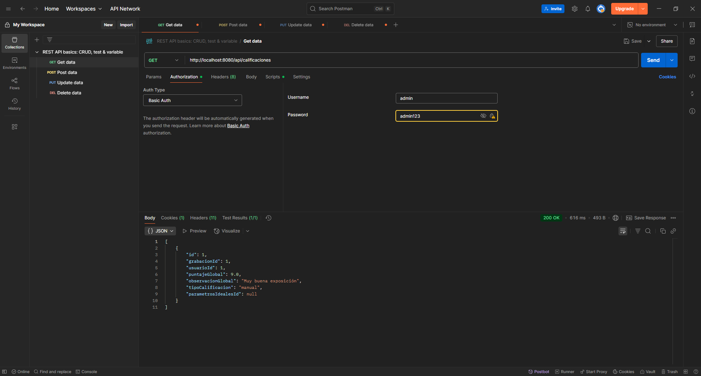

* **GET** de calificación por ID
  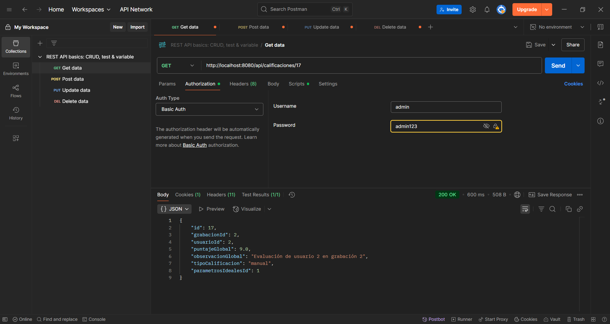

* **POST** crear nueva calificación
  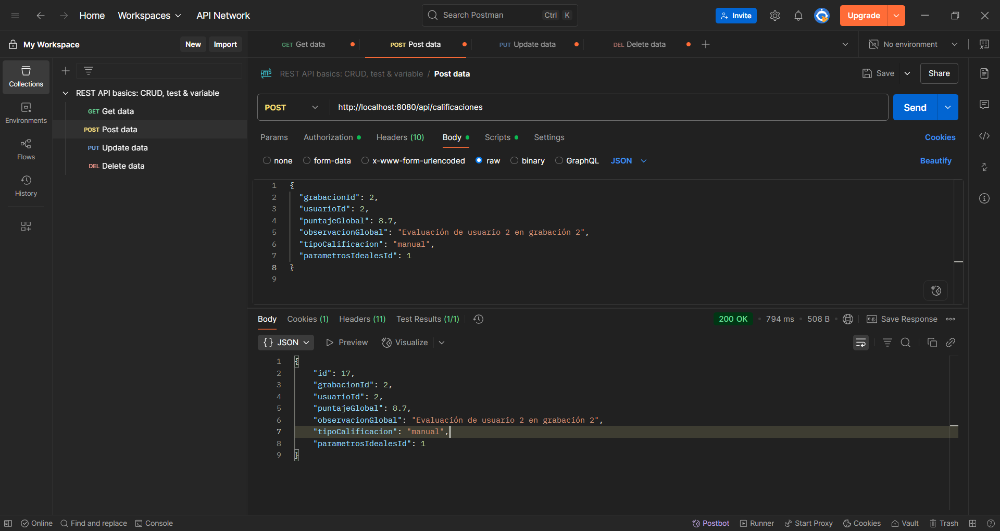

* **PUT** editar calificación existente
  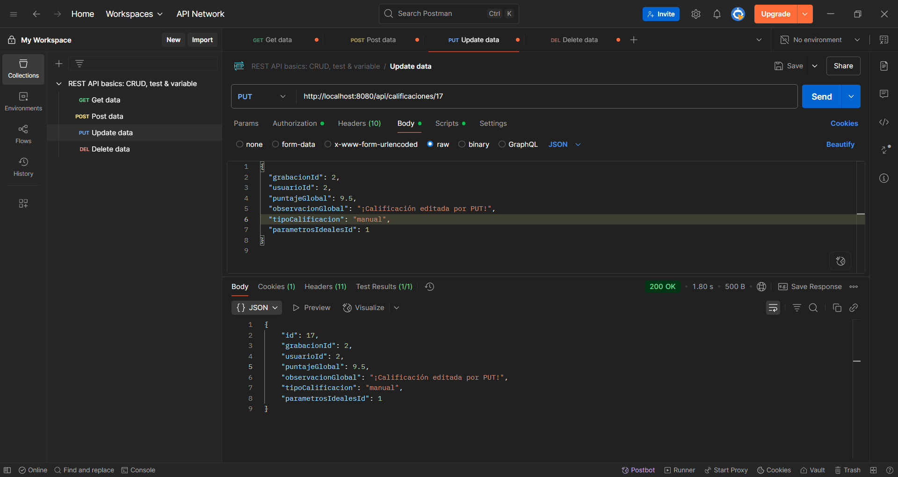

* **DELETE** calificación
  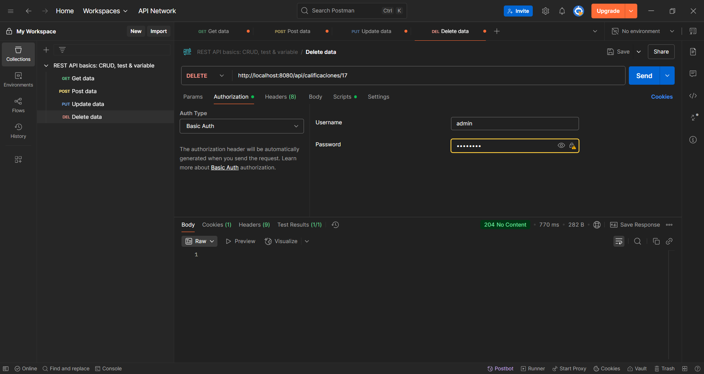

* **GET** tras eliminar (comprobar que se borró)
  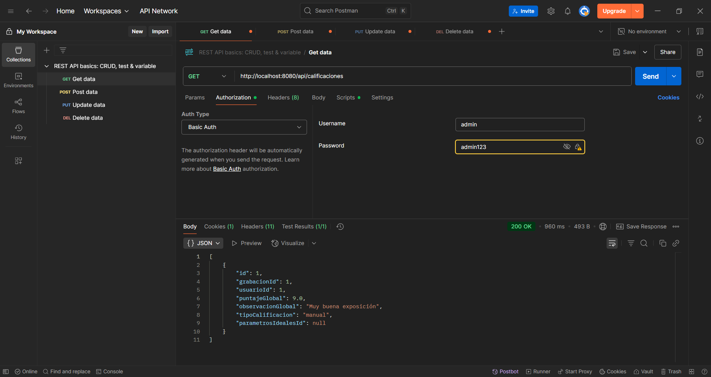

* **GET** todos los criterios de evaluación
  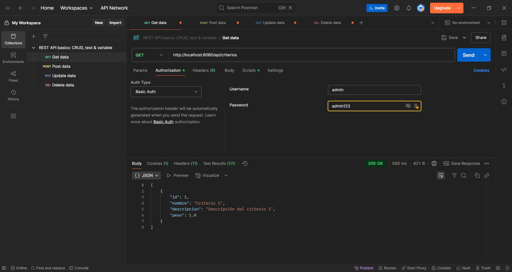

* **GET** todos los detalles de calificación
  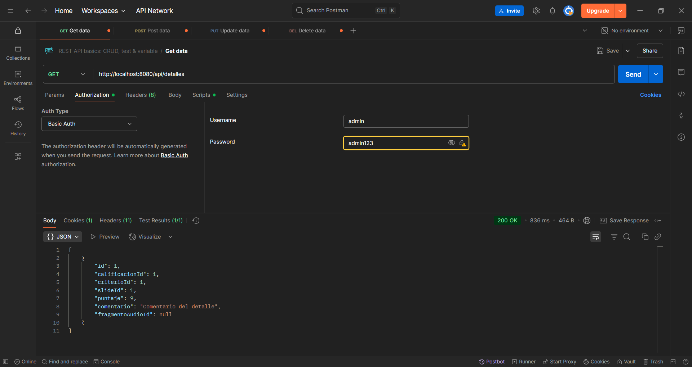

* **GET** todos los parámetros ideales
  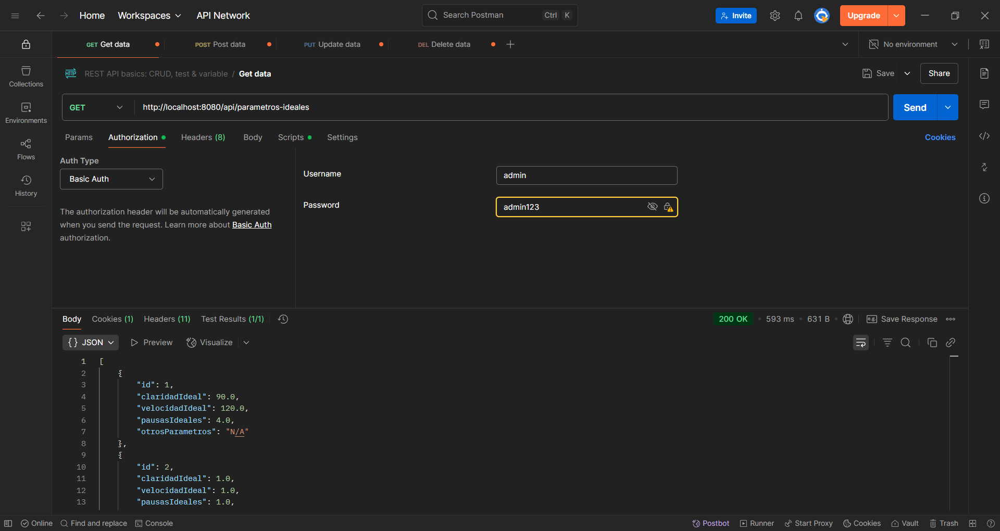

* **GET** feedbacks
  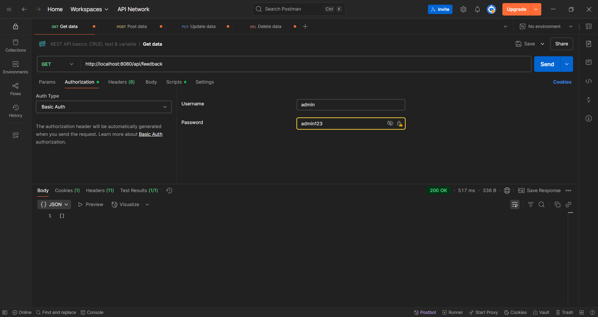

* **POST** Supabase y revisión
  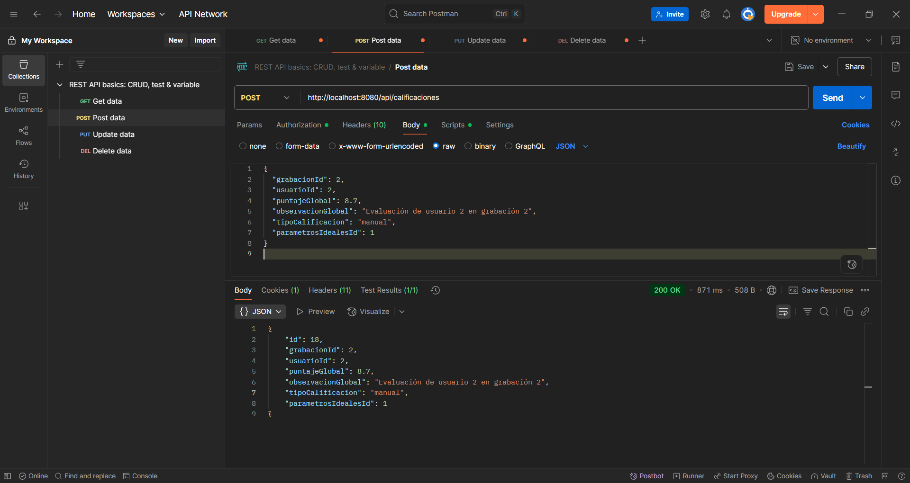
  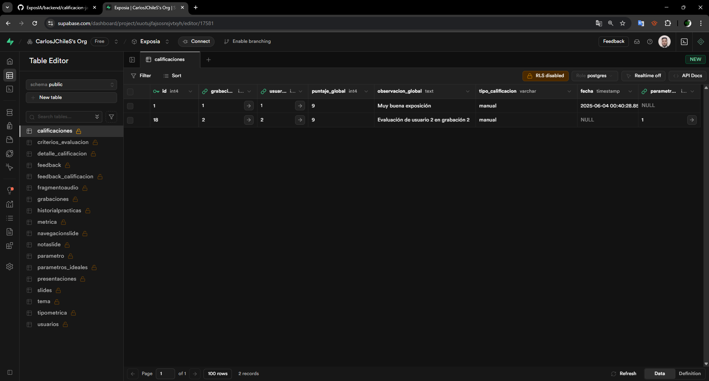


## ☁️ **Despliegue en Render**

El módulo fue desplegado correctamente en el hosting gratuito **[Render](https://render.com/)**, lo que permite consumir la API REST desde cualquier parte del mundo.

* **URL pública del backend:**
  [`https://deploy-modulo.onrender.com`](https://deploy-modulo.onrender.com)

### Endpoints accesibles en producción

Puedes consumir los endpoints principales desde internet (puedes probarlos con Postman o navegador):

* [`/api/criterios`](https://deploy-modulo.onrender.com/api/criterios)
* [`/api/calificaciones`](https://deploy-modulo.onrender.com/api/calificaciones)

### Evidencias del despliegue

* **Comprobación del despliegue en Render**
  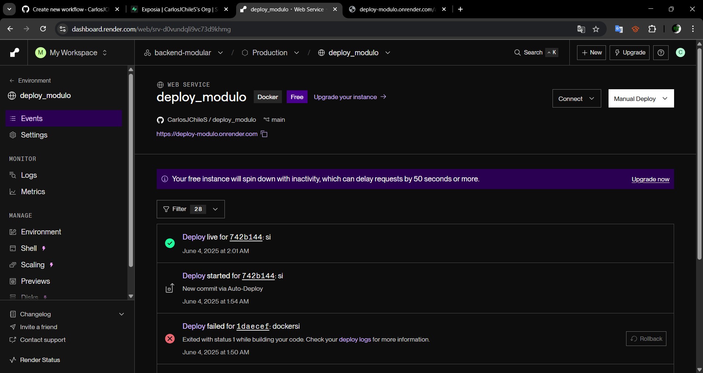

* **Consumo del endpoint `/api/calificaciones` en producción**
  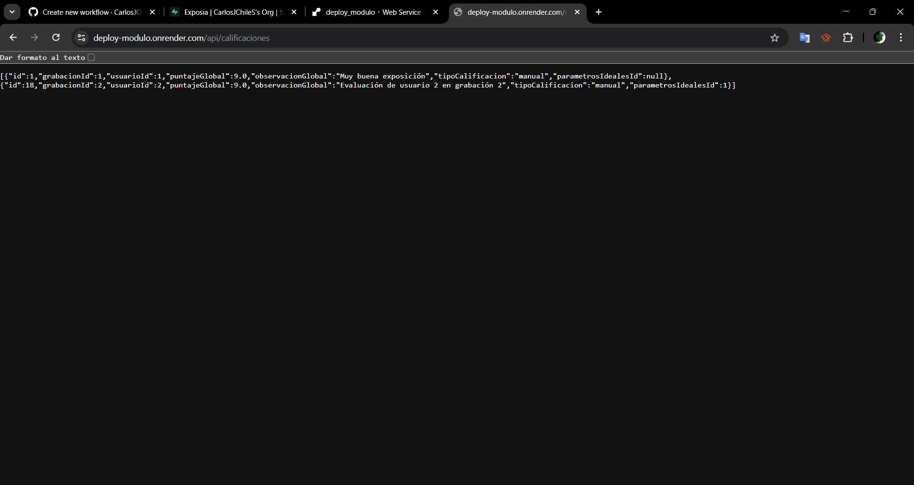

* **Consumo del endpoint `/api/criterios` en producción**
  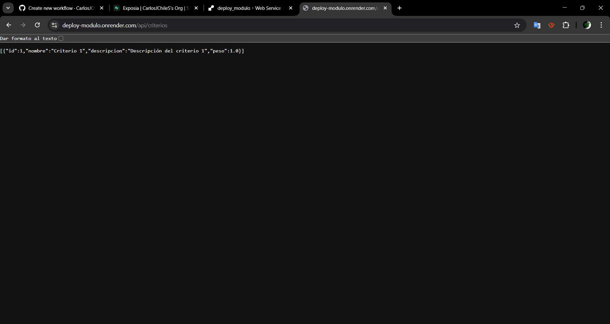

## ⚙️ Recomendaciones y Notas

* Asegúrate de que los registros relacionados (usuarios, grabaciones, parámetros ideales, etc.) existan en la base antes de hacer POST o PUT.
* Las evidencias aquí mostradas son de rutas realmente probadas con Postman.
* Puedes ampliar este módulo agregando más lógica de negocio o integraciones según las necesidades del proyecto.
* Ahora el módulo puede combinar calificaciones generadas por IA usando el nuevo método `aplicarCalificacionAI` en `CalificacionService`.

## 🤖 Calificaciones asistidas por IA


Cada detalle se promedia con el puntaje manual y se actualiza el `puntajeGlobal` final.

Ejemplo de respuesta luego de aplicar la calificación de la IA:

```json
{
  "id": 1,
uhdxmj-codex/add-service-method-for-ai-grades
  "": 7.5,
  "obspuntajeGlobalervacionGlobal": "Buena exposición"
}
```

Puedes encontrar estos ejemplos en los archivos
`examples/ai_ejemplo_peticion.json` y
`examples/ai_ejemplo_respuesta.json` para utilizarlos directamente con
Postman u otra herramienta de prueba.
=======
  "puntajeGlobal": 7.5
}
```
